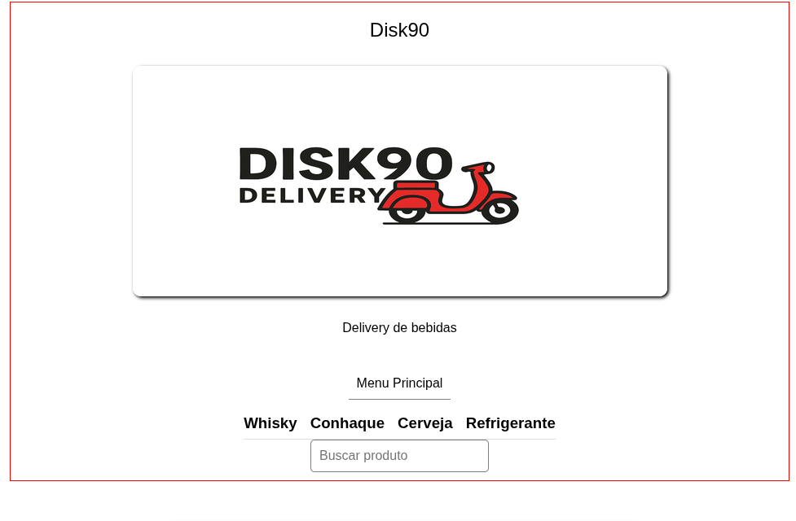
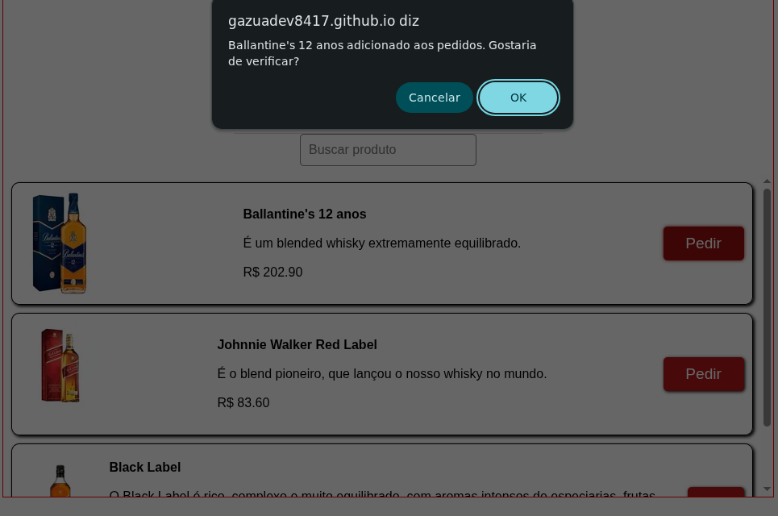
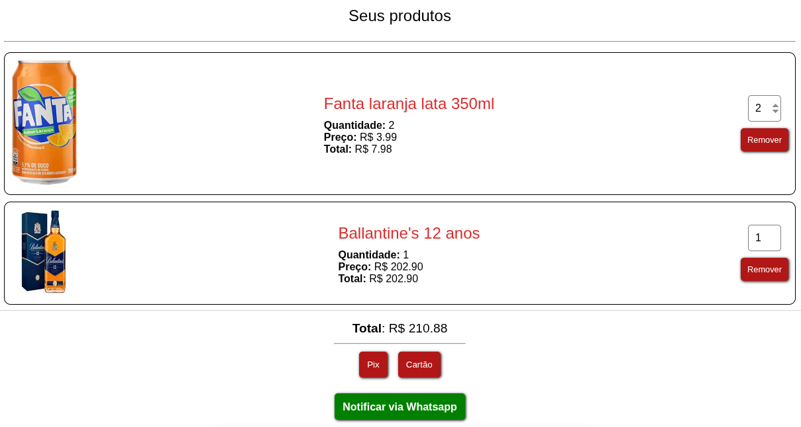
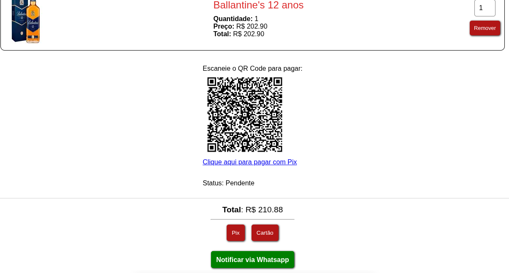
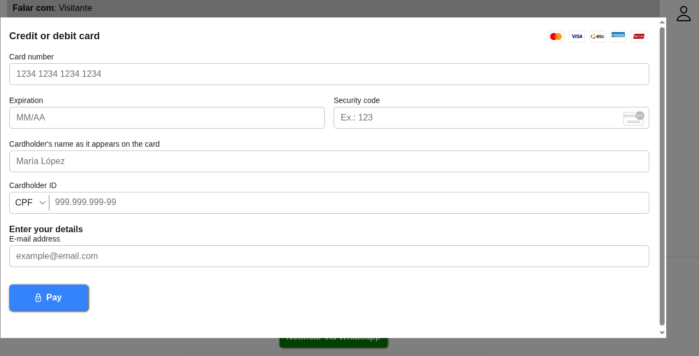

# Projeto Meu Delivery

Aplicação que simula um provedor de serviços de entrega. No caso em questão trata-se de um provedor de 
entrega de bebdias. Abaixo segue explicação do seu funcionamento com a ajuda de imagens representativas.

    
Acima está a imagem da home page da aplicação, onde temos os produtos separados por categorias, onde
clicano em cada uma delas é possível visualizar seus produtos, os quais possuem o botão pedir. Cada produto pode ser adicionado ao carrinho clicando nesse botão. 

 
 

No carrinho é possível alterar a quantidade de produtos pedidos e escolher a forma de pagamento. Como se trata de uma simulação o botão "Notificar via Whatsapp" foi posto para se ter uma ideia do que acontece quando o pagamento é realizado. Neste caso o provedor do serviço é notificado a respeito da solicitação e providencia a entrega. 

Aplicação fullstack desenvolvida em Vite React com Typescript e API com Nodejs e Express. Consulta ao banco usando Knex query builder. Foi utilizado o SDK oficial do Mercado Pago @mercadopago/sdk-react, para simular as opções de pagamento, que até então são realizadas em modo teste por se tratar de uma demonstração. Abaixo seguem os links da aplicação e da documentação da API.

>Link da aplicação: https://gazuadev8417.github.io/meu-delivery/

>Documentação: https://documenter.getpostman.com/view/48121909/2sB3HjM1z7  
