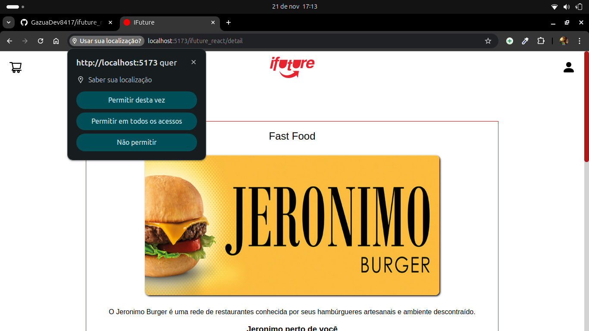
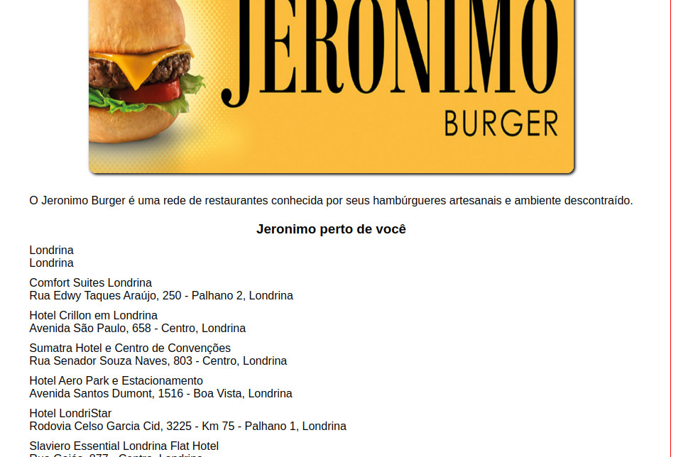
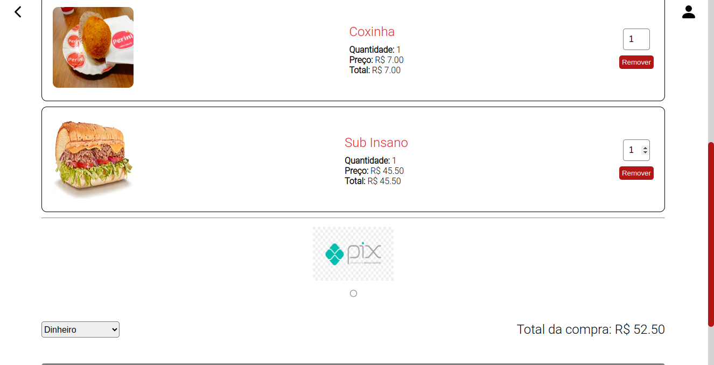
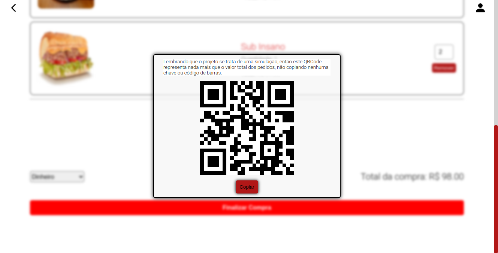
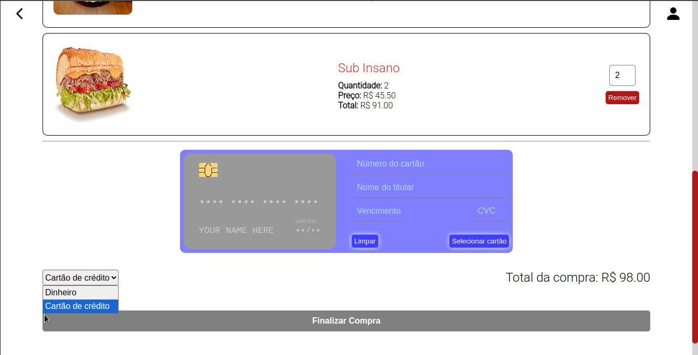

# Projeto Ifuture

Aplicação que simula de forma demonstrativa o sistema de entregas de alimentos. 
Por ser demonstrativa a aplicação não apresenta os métodos de localização disponibilizado pelo Google, o que a deixaria mais aplicável. No entanto, tenho como único intuíto neste projeto, apresentar minhas skills de uma maneira tão ampla quanto generalizada, por isso uma aplicação fullstack.

Neste frontend é apresentada uma lista de restaurantes, que podem também ser dividos por categorias, como mostra figura abaixo:
     
Ao clicar na categoria os respectivos restaurantes são listados de acordo com a categoria selecionada. Da mesma forma o input para busca resulta somente em restaurantes listados na respectiva categoria, sendo assim se o suário buscar por um restaurante que esteja na aplicação mas não pertence à categoria selecionada o resultado será 'Nenhum restaurante encontrado!'.

Ao clicar no card de um restaurante o usuário é direcionado para página de detalhes do mesmo, contendo sua descrição, cardápio e endereços próximos ao usuário logado, para isso é necessário permitir sua localização. Esta página é onde o usuário pode fazer seus pedidos, adicioná-los ao carrinho e finalizar sua compra.
   &nbsp;&nbsp; 
  Todos os pedios realizados pelo usuário vão para o carrinho. Lá o usuário pode alterar a quantidade dos produtos do seu pedido. O valor de cada pedido juntamente com o total da compra altera de forma simultânea com a quantidade.
   &nbsp;&nbsp;&nbsp;

Dentre os métodos de pagamento a aplicação apresenta duas implementações, uma para dinheiro utilizando transferência pix com o auxílio de um QRCode que é gerado pela aplicação. O QRCode gerado representa o total da compra, se o usuário escaneá-lo verá a numeração correspondente ao valor.
   

Ao clicar em copiar o valor total da compra vai para área de transfêrencia.

No método cartão de crédito foi utilizada a biblioteca react-credit-cards.
   

><b>Obsservação</b>: Lembrando que, como se trata de uma demontração, ao selecionar o cartão o botão para finalizar a compra é habilitado. Está implementação se limita ao frontend, servindo unicamente para habilitação do botão 'Finalizar Compra'. Na <a href='https://github.com/GazuaDev8417/ifuture_server'>API</a>, acessando a rota 'app.patch('/finished_orders/:id', orderController.endOrders)', do arquivo index.ts, no diretório src, e navegando por suas classes conseguintes, é possivel verificar que não há envio de dados de cartão de crédito.

  
>Link da aplicação: https://gazuadev8417.github.io/ifuture_react/ 
